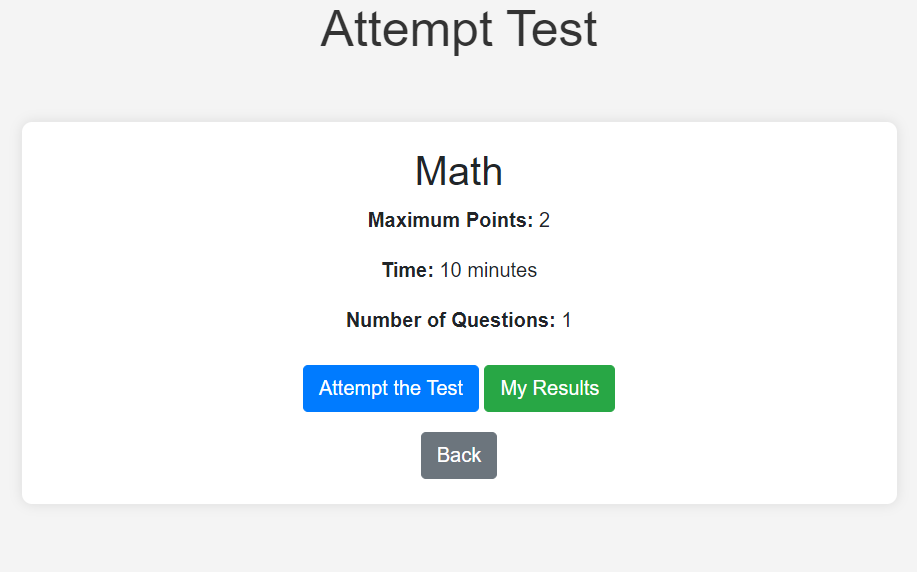
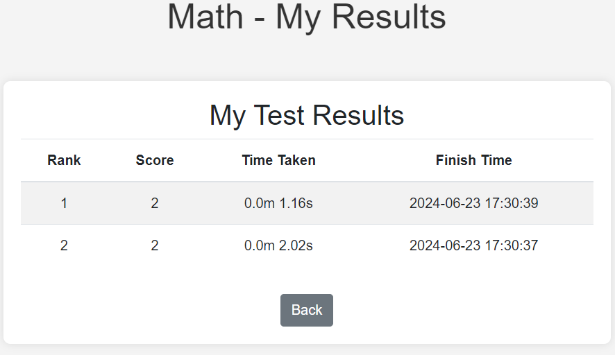
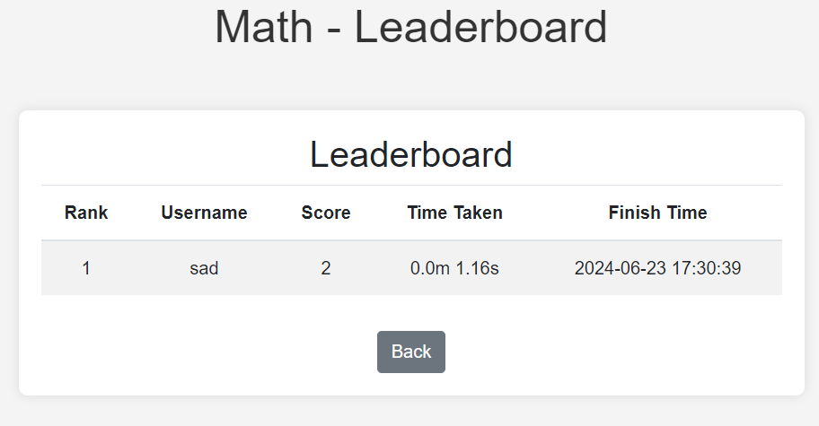

# QuickQuiz (Tests) Project

## Overview

QuickQuiz is a simple quiz application that allows users to register, log in, create quizzes, add questions to quizzes, and attempt quizzes. This project uses Flask, SQLAlchemy, and pytest for testing.

## Requirements

Use need to have installed the sqlite3 database before running the application. You can check if you have it installed by running the following command:
```bash
sqlite3 -version
```
Simple output:
```
3.36.0 2021-06-18 18:36:39 3bfa9cc97da105f7c6f3b9e5f9b6
```
if you don't have it installed you can install it by following the instructions on the following link:
https://www.sqlite.org/download.html


## Installation

1. **Clone the repository:**

   ```bash
   git clone https://github.com/bbkanev/Project_2_SS24.git
   ```
   ```bash
   cd Project_2_SS24
   ```
2. **Create a virtual environment:**

   ```bash
   python -m venv venv
    ```
3. **Activate the virtual environment:**
    ```bash
    venv\Scripts\activate
    ```
4. **Install the dependencies:**
   ```bash
   pip install -r requirements.txt
   ```
   
## Running the Application and Tests

1. Run the app.py file:
   ```bash
   python app.py
   ```
   or
   ```bash
   py app.py
   ```
2. Open your browser and navigate to
    ```
    http://127.0.0.1:5000/
    ```

3. Go to the register page and create a new account.
    ```
    http://127.0.0.1:5000/register
    ```
   Simple user to register: 
   ```
    username: user
    password: Test!1234
    email:test@test.com
    ```
   
4. Log in with the newly created account.
    ```
    http://127.0.0.1:5000/login
    ```
   
5. Create a new test.
    ```
    http://127.0.0.1:5000/add_test
    ```
   Simple test to add:
    ```
    Test Name: Geography
    Time: 1 
    ```
   
6. Go to edit test by clicking the button edit test.
7. Add questions to the test.
   Simple question to add:
    ```
    Question: What is the capital of France?
    Answer: Paris
    Option1: London
    Option2: Berlin
    Points: 5
    ```
8. Publish the test by clicking the publish button.
9. Log out and register a new user.
    ```
    http://127.0.0.1/logout
    ```
    ```
    username: user2
    password: Test!1234
    email: test2@test.com
    ```
   
10. Go and attempt the test Geography.

11. Submitting the test and go to my results to see the results.

12. Go back to the home page and click the button leaderboard to see the leaderboard.

13. Go to the terminal and stop the app by pressing Ctrl+C.
14. Then Run the tests by typing the following command:
    ```bash
    pytest
    ```

